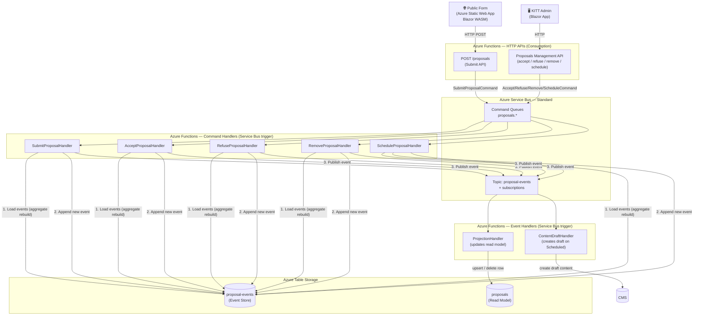

# Proposal Refactor — Architecture Document

This document describes the full architectural design for the proposal management refactor.
The system is built on **CQRS + Event Sourcing** principles and hosted entirely on Azure, with a
deliberate focus on minimising running costs.

---

## Domain Overview

People submit content proposals via a public form at https://proposte.morialberto.it.
KITT (the admin app) lets the owner review, accept, refuse, schedule or remove proposals.
Scheduling a proposal creates a draft content item in the CMS.

### Proposal Lifecycle

```
             ┌───────────────────────────────────────────────────┐
             │                    SUBMITTED                       │
             └────────────────┬──────────────────────────────────┘
                              │
              ┌───────────────┴───────────────┐
              ▼                               ▼
         ACCEPTED                          REFUSED  (terminal)
              │
     ┌────────┴────────┐
     ▼                 ▼
SCHEDULED          REMOVED
(terminal)         (terminal)
```

### Proposal Statuses

| Status      | Description                                          | Terminal |
|-------------|------------------------------------------------------|----------|
| `Submitted` | Newly submitted, awaiting owner review               | No       |
| `Accepted`  | Owner accepted; in backlog waiting to be scheduled   | No       |
| `Refused`   | Owner refused the proposal (was `Submitted`)         | Yes      |
| `Removed`   | Owner removed from backlog (was `Accepted`)          | Yes      |
| `Scheduled` | Proposal converted into a draft content item         | Yes      |

### Content Types (for scheduling)

| Value          | Description              |
|----------------|--------------------------|
| `Livestream`   | Twitch livestream        |
| `YoutubeVideo` | YouTube video            |
| `BlogPost`     | Blog post                |

---

## Commands and Events

### Commands

| Command                  | Guard                              | Produced Event           |
|--------------------------|------------------------------------|--------------------------|
| `SubmitProposalCommand`  | —                                  | `ProposalSubmittedEvent` |
| `AcceptProposalCommand`  | Status = `Submitted`               | `ProposalAcceptedEvent`  |
| `RefuseProposalCommand`  | Status = `Submitted`               | `ProposalRefusedEvent`   |
| `RemoveProposalCommand`  | Status = `Accepted`                | `ProposalRemovedEvent`   |
| `ScheduleProposalCommand`| Status = `Accepted`, ContentType ≠ null | `ProposalScheduledEvent` |

### Events

Each event carries at minimum: `ProposalId`, `OccurredAt`, and event-specific payload.

| Event                    | Key Payload                                      |
|--------------------------|--------------------------------------------------|
| `ProposalSubmittedEvent` | Title, Description, AuthorNickname, SubmittedAt  |
| `ProposalAcceptedEvent`  | —                                                |
| `ProposalRefusedEvent`   | —                                                |
| `ProposalRemovedEvent`   | —                                                |
| `ProposalScheduledEvent` | ContentType, DraftContentId                      |

---

## Azure Services

### Services used and rationale

| Service | Tier | Purpose | Est. monthly cost |
|---|---|---|---|
| **Azure Static Web App** | Free | Public proposal form (Blazor WASM) | $0 |
| **Azure Functions** | Consumption | All HTTP APIs + command/event handlers | ~$0 (1M free exec/month) |
| **Azure Service Bus** | Standard | Command queues + event topics | ~$10 |
| **Azure Table Storage** | LRS | Event store + read model (proposals) | < $1 |

> **Why Service Bus Standard and not Basic?**
> The Basic tier only supports queues (point-to-point). The Standard tier adds
> Topics + Subscriptions, which are required for the fan-out pattern (one event → multiple
> independent handlers). At $10/month it is the most cost-effective choice for
> proper pub/sub on Azure.

> **Why Azure Table Storage and not Cosmos DB?**
> Cosmos DB offers richer query capabilities but starts at $25/month (provisioned) or
> ~$0.25/RU for serverless. For an event store and a simple read model Table Storage is
> sufficient at a fraction of the cost (~$0.045/GB + minimal transaction fees).

### Service Bus topology

```
QUEUES (commands — point-to-point)
  proposals.submit
  proposals.accept
  proposals.refuse
  proposals.remove
  proposals.schedule

TOPICS + SUBSCRIPTIONS (events — fan-out)
  proposal-events
    └── projection          (updates read model)
    └── content-draft       (creates draft content on ProposalScheduled)
```

### Azure Table Storage schema

**Table: `proposal-events`** (event store)

| Column       | Value                                   |
|--------------|-----------------------------------------|
| PartitionKey | `proposalId` (Guid as string)           |
| RowKey       | Zero-padded sequence number (`00000001`) |
| EventType    | e.g. `ProposalSubmittedEvent`           |
| EventData    | JSON-serialised event payload           |
| OccurredAt   | ISO 8601 UTC timestamp                  |

**Table: `proposals`** (read model)

| Column          | Value                                 |
|-----------------|---------------------------------------|
| PartitionKey    | `proposals`                           |
| RowKey          | `proposalId` (Guid as string)         |
| Title           | string                                |
| Description     | string                                |
| AuthorNickname  | string                                |
| Status          | enum string                           |
| SubmittedAt     | ISO 8601 UTC timestamp                |
| ContentType     | string (populated on Scheduled)       |
| DraftContentId  | Guid string (populated on Scheduled)  |

---

## Architectural Flow



---

## Detailed Flow per Operation

### Submit a proposal (public)

1. User fills the form and submits.
2. The Static Web App calls the **Submit API** (Azure Function HTTP trigger).
3. The API sends a `SubmitProposalCommand` to the `proposals.submit` queue.
4. The **SubmitProposalHandler** function is triggered:
   - Creates a new `ProposalId` (Guid).
   - Stores `ProposalSubmittedEvent` (version 1) in the event store.
   - Publishes the event to the `proposal-events` topic.
5. The **ProjectionHandler** subscription creates a new row in the `proposals` read model.

### Accept a proposal

1. KITT calls `PATCH /proposals/{id}` on the Management API.
2. The API sends `AcceptProposalCommand` to the `proposals.accept` queue.
3. **AcceptProposalHandler**:
   - Loads all events for `proposalId` → rebuilds aggregate state.
   - **Guard**: status must be `Submitted`. Throws if not.
   - Stores `ProposalAcceptedEvent` in the event store.
   - Publishes event to `proposal-events` topic.
4. **ProjectionHandler** updates the row status to `Accepted`.

### Refuse a proposal

1. KITT calls `DELETE /proposals/{id}/refuse` on the Management API.
2. The API sends `RefuseProposalCommand` to the `proposals.refuse` queue.
3. **RefuseProposalHandler**:
   - Loads events → rebuilds aggregate.
   - **Guard**: status must be `Submitted`. Throws if not.
   - Stores `ProposalRefusedEvent` in the event store.
   - Publishes event to `proposal-events` topic.
4. **ProjectionHandler** deletes the row from the `proposals` read model.

### Remove an accepted proposal

1. KITT calls `DELETE /proposals/{id}` on the Management API.
2. The API sends `RemoveProposalCommand` to the `proposals.remove` queue.
3. **RemoveProposalHandler**:
   - Loads events → rebuilds aggregate.
   - **Guard**: status must be `Accepted`. Throws if not.
   - Stores `ProposalRemovedEvent` in the event store.
   - Publishes event to `proposal-events` topic.
4. **ProjectionHandler** deletes the row from the `proposals` read model.

### Schedule a proposal

1. KITT calls `POST /proposals/{id}/schedule` on the Management API (body includes `ContentType`).
2. The API sends `ScheduleProposalCommand` to the `proposals.schedule` queue.
3. **ScheduleProposalHandler**:
   - Loads events → rebuilds aggregate.
   - **Guard**: status must be `Accepted`. Throws if not.
   - **Guard**: `ContentType` must not be null. Throws if not.
   - Generates a `DraftContentId`.
   - Stores `ProposalScheduledEvent` (includes `ContentType`, `DraftContentId`) in the event store.
   - Publishes event to `proposal-events` topic.
4. Two independent subscriptions are triggered:
   - **ProjectionHandler**: deletes the row from the `proposals` read model.
   - **ContentDraftHandler**: creates a draft content item in the CMS for the given `ContentType`.

---

## Aggregate Reconstruction Pattern

Each command handler must:

1. Query `proposal-events` table by `PartitionKey = proposalId`, ordered by `RowKey ASC`.
2. Replay events in order to derive the current aggregate state (status, etc.).
3. Validate guards against the derived state.
4. Append the new event with `RowKey = (lastVersion + 1)`, using ETags for optimistic concurrency.
5. Publish the event to the Service Bus topic.

---

## Error Handling and Resilience

- **Dead-letter queues**: every Service Bus queue and subscription retains failed messages in its DLQ for inspection.
- **Idempotency**: event handlers must be idempotent; the `(PartitionKey, RowKey)` pair in the event store acts as a natural idempotency key.
- **Optimistic concurrency**: use the Azure Table Storage ETag on the last-known event row when appending a new event to detect concurrent writes.

---

## Cost Estimate Summary

| Component | Monthly cost |
|---|---|
| Azure Static Web App (Free) | $0 |
| Azure Functions (Consumption) | $0 (within free tier for low traffic) |
| Azure Service Bus Standard | ~$10 |
| Azure Table Storage (< 1 GB, low transactions) | < $1 |
| **Total** | **~$11/month** |

